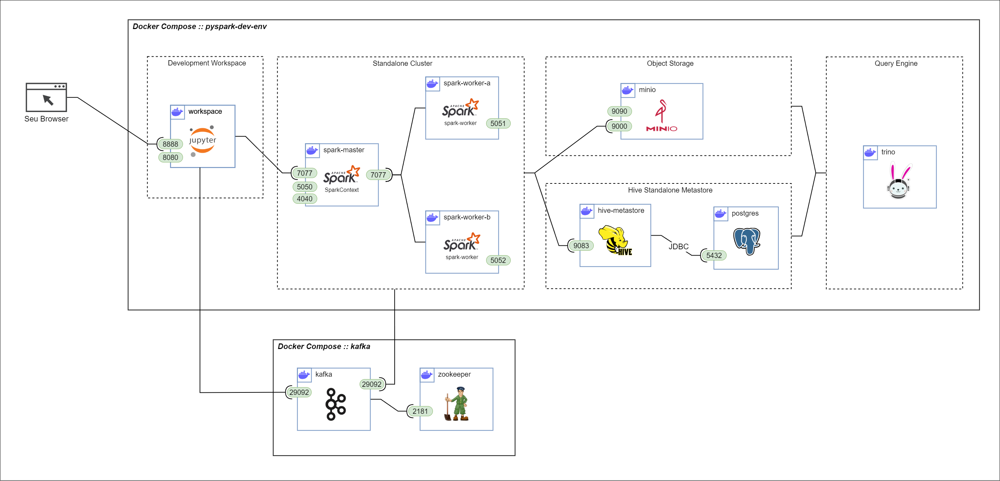

# Ambiente de desenvolvimento interativo de Apache Spark

Montado utilizando Docker Compose, Apache Spark, MinIO, Hive, PostgresSQL e Jupyter

Requisitos:
- Docker Desktop
- Docker Compose

Para utilizá-lo basta clonar o repositório e executar no diretório principal o comando:

> docker compose up -d

Acesse os logs do workspace para obter o link do Jupyter Lab.

> docker logs pyspark-dev-env-workspace-1

Clique no link _http://127.0.0.1:8888/lab?token=<token_gigante_super_seguro>_

## O que é criado?

O template docker-compose.yml cria uma série de containers, entre eles:

#### Workspace
Um cliente Jupyter para sessões de desenvolvimento interativo com:
+ Diretório 'work' para persistir scripts e notebooks criados;
+ spark-defaults.conf para facilitar configuração das SparkSessions no cluster;

#### MinIO
Uma instância do MinIO, serviço de object storage que emula o funcionamento de um S3 com:
+ Interface web acessivel em localhost:9090
+ API para protocolo s3a na porta 9000
+ Diretório _mount/minio_ e _mount/minio-config_ para persistir dados entre sessões

#### Standalone Spark Cluster
Um cluster Spark para processamento dos workloads contendo:
+ 1 Master node (master na porta 7077, web-ui em localhost:5050)
+ 2 Worker node (web-ui em localhost:5051 e localhost:5052)
+ Dependências necessárias para conexão com o MinIO já instaladas nas imagens
+ Comunicação com MinIO através da porta 9000

#### Hive Standalone Metastore
Uma instância do Hive Standalone Metastore utilizando PostgreSQL no back-end para permitir a criação de tabelas externas.
+ Diretório _mount/postgres_ para persistir tabelas entre sessões de desenvolvimento
+ Comunicação com o cluster Spark através do Thrift na porta 9083
+ Comunicação com o PostgresSQL através de JDBC na porta 5432